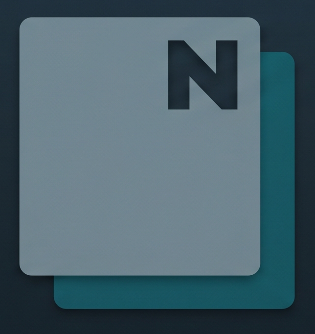
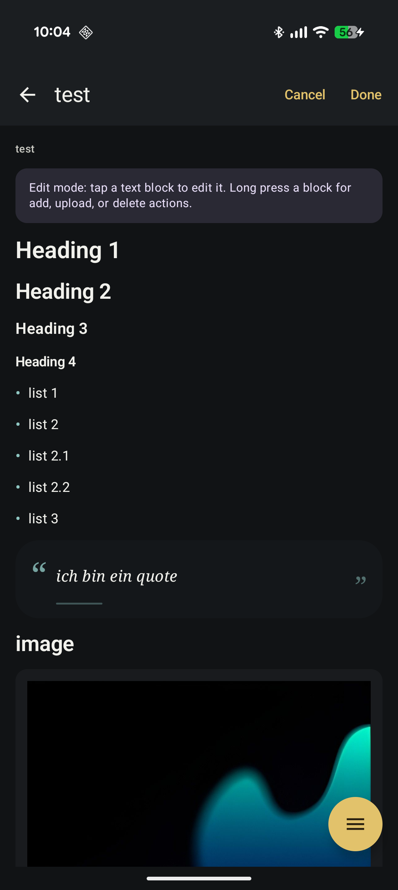
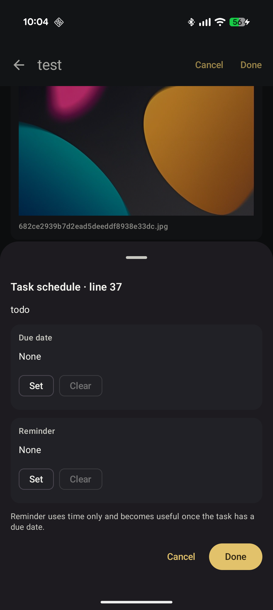
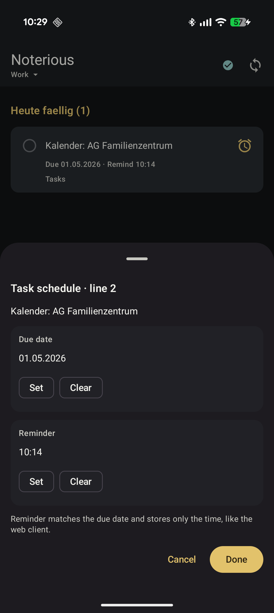

<p align="center">
  
</p>

# Noterious Android

Android client for Noterious.

It focuses on fast note browsing and a mobile-friendly reading/editing flow for the same markdown-first knowledge base used by the web client.

## Screenshots

<p align="center">
  
  
  
</p>

## What It Already Does

- Browse notes and documents across scopes
- Open notes with proper back navigation
- Render headings, lists, tasks, quotes, code fences, tables, links, and images
- Run and display embedded queries
- Toggle tasks and edit task due/reminder metadata
- Use interactive task cards from home, tasks, and search, including source-page open/delete actions
- Edit notes with a lightweight GUI edit mode plus raw markdown mode
- Upload files and insert image/document links
- Save or share embedded images

## Release

The latest downloadable APK is published in the GitHub Releases section.

Current app version: `0.1.1`

## Build

Requirements:

- Android SDK / build-tools for API 36
- Java 17

Build the debug APK:

```bash
./gradlew :app:assembleDebug
```

The APK will be written to:

```text
app/build/outputs/apk/debug/app-debug.apk
```

## License

Licensed under the GNU General Public License v3.0. See [LICENSE](LICENSE).
